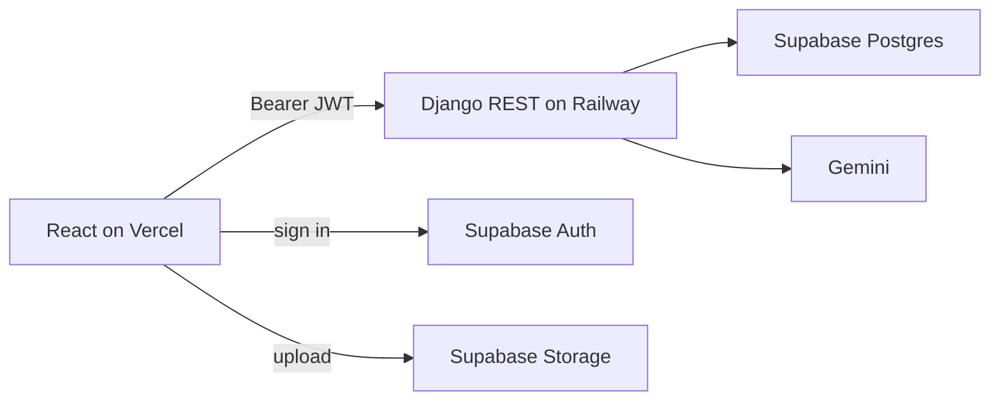
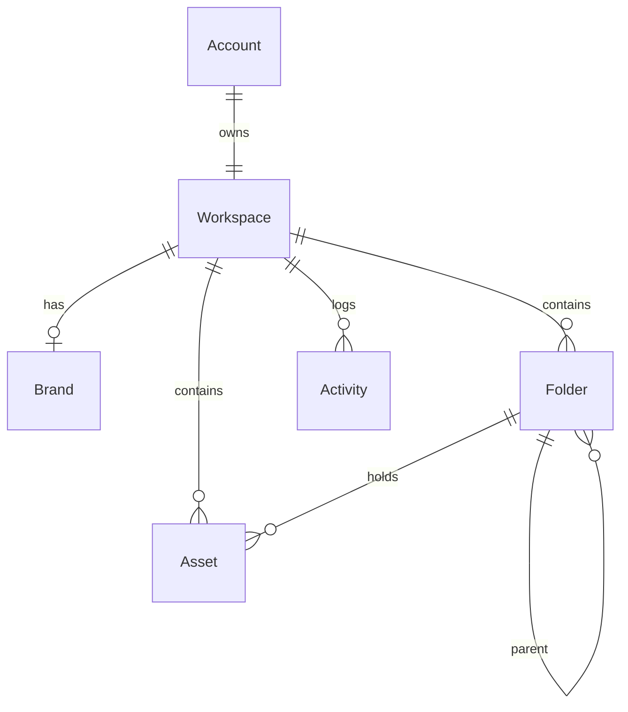

# BrandVault

One signed-in user gets one workspace: a brand kit and an asset library with folders, search, sort, trash, and restore. Tag suggestions come from Gemini on the API and are saved only after the user reviews them.

## Live demo

- App: https://brandvault-omega.vercel.app/
- API: https://brandvault-production.up.railway.app/api/health
- API docs: https://brandvault-production.up.railway.app/api/docs
- Demo login: `demo@brandvault.dev` / `Demo1234!`
- The login page also has **Continue as demo**, which signs in as that account.
- Walkthrough: https://www.loom.com/share/4724f025f1754e4d894c7a6953a2ae2c

## Stack

- React, TypeScript, Vite, Tailwind CSS (Vercel)
- Django and Django REST Framework (Railway)
- PostgreSQL, Auth, and Storage on Supabase
- Gemini for tag suggestions, called only from Django
- n8n webhook: `n8n/brandvault-webhook.json`

Schema is in the Django migrations under `backend/accounts`, `backend/brands`, and `backend/library`.

## Architecture

The browser talks to Supabase for sign-in and file upload, and to Django for brand and library data. Gemini, the database URL, and the Django secret stay on the API.



## Data model

One account, created on first sign-in, owns one workspace. The brand, folders, assets, and activity rows all belong to that workspace.



Folders nest to a maximum depth of 3. An asset has a name, type, URL and/or storage path, optional folder, tags, description, usage suggestion, and `deleted_at`.

Trashing an asset sets `deleted_at`. The library lists only live assets. Trash lists only deleted ones. `DELETE /api/assets/:id` permanently removes an asset that is already in trash.

**Folder deletion.** A folder cannot be deleted while it has a child folder or any asset, including a trashed one. The API returns 409. Empty folders can be deleted.

## Authorization

Every route except `GET /api/health` and the docs at `/api/docs` requires a Supabase JWT. Django checks the token, then loads that user’s one workspace.

Brand, folder, asset, and activity queries are filtered to that workspace. Asking for another user’s id returns 404, not the row. A missing or invalid token returns 401. Invalid input returns 400.

Uploaded files live under `workspaces/{supabase_user_id}/`. Storage policies allow only that user to write there.

## Local setup

1. Copy `backend/.env.example` to `backend/.env` and `frontend/.env.example` to `frontend/.env`. Fill in the Supabase and database values.
2. `python -m venv venv`
3. `venv\Scripts\activate` on Windows, or `source venv/bin/activate`
4. `pip install -r backend/requirements.txt`
5. `python backend/manage.py migrate`
6. `python backend/manage.py runserver`
7. `cd frontend && npm install && npm run dev`

Open `http://localhost:5173`. The API is `http://localhost:8000`. Docs are at `http://localhost:8000/api/docs`.

The deployed demo uses Supabase Postgres. With `DEBUG=True` and an empty `DATABASE_URL`, Django falls back to SQLite so the API can boot locally. An empty `GEMINI_API_KEY` still lets the API start; tag generation returns 501.

API tests: `cd backend && python -m pytest`

## API

Paths are under `/api`. The same list, with request bodies, is at `/api/docs`.

| Resource | Endpoints |
| --- | --- |
| Brand | `GET /brand`, `POST /brand`, `PATCH /brand` |
| Folders | `GET /folders`, `POST /folders`, `PATCH /folders/:id`, `DELETE /folders/:id` |
| Assets | `GET /assets`, `POST /assets`, `PATCH /assets/:id` |
| Trash | `POST /assets/:id/trash`, `POST /assets/:id/restore` |
| Permanent delete | `DELETE /assets/:id` (trash only) |
| GenAI | `POST /assets/:id/ai-tags`, `PATCH /assets/:id/ai-tags/save` |
| Activity | `GET /activity` |

`GET /assets` accepts `folder` (`root` or a folder id), `search`, and `sort` (`updated_desc` by default, or `name_asc`). Search matches name, description, and tags.

## GenAI

- Provider: Google Gemini (`GEMINI_MODEL`, then `GEMINI_FALLBACK_MODEL` if the first model is overloaded).
- Suggest: `POST /api/assets/:id/ai-tags`. This does not write the asset.
- Save: `PATCH /api/assets/:id/ai-tags/save`, after the user accepts or edits the suggestion.
- Prompt: `backend/prompts/asset-tagging.md`.
- Input: asset name, type, URL, optional folder name, optional brand name and colors. The prompt tells the model not to invent facts outside that input.
- Validation: the model must return JSON with `tags`, `description`, and `usage_suggestion`. `normalize_suggestion` checks that again (3 to 8 short tags, two short sentences). Invalid model JSON returns 502 and is not stored. An invalid reviewed payload returns 400.
- If Gemini returns 503, the API retries the primary model, then the fallback. A 429 rate limit switches to the fallback immediately, so the capped model is not called again. If both stay unavailable, nothing is saved and the UI asks the user to try again. Sign-in, the brand kit, and the library are unaffected.

## n8n

Django sends a webhook after the database commit when a brand kit is updated, an asset is restored, or reviewed tags are saved. An empty `N8N_WEBHOOK_URL` sends nothing, and a failed webhook does not fail the request.

| Event | When |
| --- | --- |
| `brand.updated` | Brand kit `PATCH` succeeds |
| `asset.restored` | Asset is restored from trash |
| `asset.ai_tags_saved` | Reviewed AI tags are saved |

```json
{
  "event": "asset.ai_tags_saved",
  "timestamp": "2026-09-27T17:00:00+00:00",
  "asset_id": "11111111-1111-1111-1111-111111111111",
  "user_email": "demo@brandvault.dev"
}
```

`brand.updated` sends `brand_id` instead of `asset_id`.

Workflow file: `n8n/brandvault-webhook.json`. It logs the body. The email node is in the file and left disabled.

## Also included

- File upload to Supabase Storage, including the brand logo
- Drag a file onto a folder to move it
- Activity log
- Permanent delete from Trash
- Dark mode
- API tests
- Swagger docs at `/api/docs`
- The n8n webhook, described above

## Tradeoffs and what I skipped

- One workspace per user. No switcher, invites, or roles.
- Brand delete is not implemented.
- The browser uploads files straight to Storage. Django stores the path and never sees the file bytes.
- The Storage bucket is public so previews can use a public URL. Writes are still limited to the owner’s folder.
- No social publishing, payments, or image generation.

## Next improvements

1. Run tag generation in the background. The click returns immediately, Gemini runs on the API, and the library tells the user when the suggestion is ready. Today the page waits on that request for the whole call.
2. Let one user own more than one workspace. A freelancer keeps each client’s brand kit and files apart. Someone with two products does not mix their logos and folders. A practice workspace stays separate from real work.
3. Invite someone else into a workspace. A designer and a marketer can use the same brand without sharing a login. The owner chooses who can edit and who can only view.
