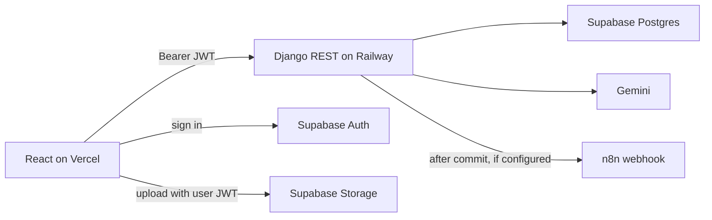
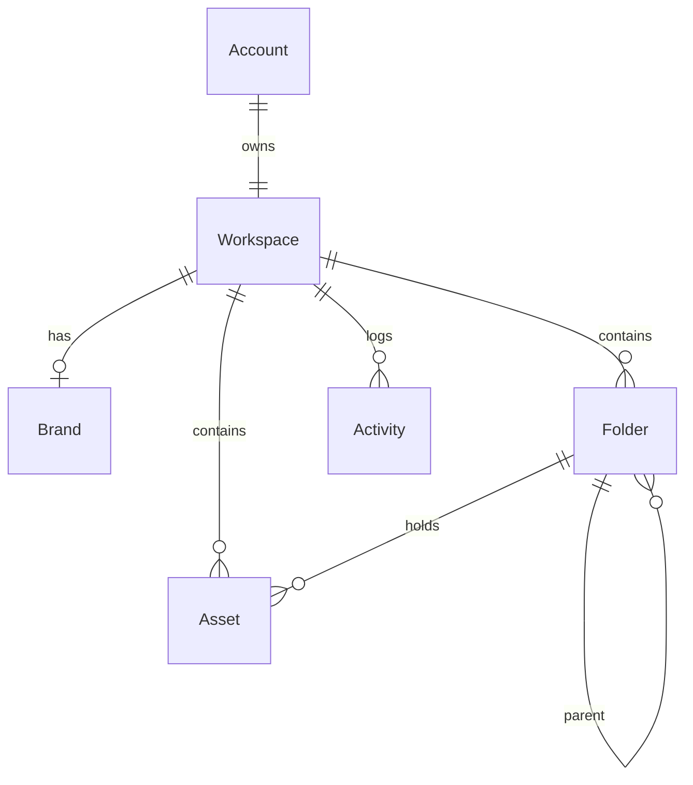

# BrandVault

One signed-in user gets one workspace: a brand kit and an asset library with folders, search, sort, trash, and restore. Tag suggestions come from Gemini on the API. They are saved only after the user reviews them.

## Live demo

- App: https://brandvault-omega.vercel.app/
- API: https://brandvault-production.up.railway.app/api/health
- Demo login: `demo@brandvault.dev` / `Demo1234!`
- Or use **Continue as demo** on the login page. That still signs in through Supabase. It is not an API bypass.
- Walkthrough: paste the Loom URL here before you send the submission email.

Google sign-in is optional. Email and password, or the demo button, is enough.

## Stack

- React, TypeScript, Vite, Tailwind CSS (Vercel)
- Django and Django REST Framework (Railway)
- PostgreSQL on Supabase (the deployed demo does not use SQLite)
- Supabase Auth (email/password, demo account, optional Google)
- Supabase Storage for asset files and the brand logo
- Gemini for tag suggestions, called only from Django
- Optional n8n webhook: `n8n/brandvault-webhook.json`

Schema is in Django migrations under `backend/accounts/migrations`, `backend/brands/migrations`, and `backend/library/migrations`.

## Architecture

The browser never holds the Gemini key, the Django secret, or the database URL. File bytes go from the browser to Storage with the signed-in user's Supabase JWT. Django stores the path and the public URL.



Tradeoff: auth and files live in Supabase, while brand and library rows live behind Django. One workspace query filter is the authorization rule for those rows. Storage has its own policies, scoped by the Supabase user id, because Storage cannot see the Django workspace id.

## Data model

One account, created on first valid sign-in, owns one workspace. Brand, folders, assets, and activity rows all point at that workspace.



| Model | Role |
| --- | --- |
| `Account` | Maps a Supabase user id to a local user. |
| `Workspace` | Single library for that account. No switcher. |
| `Brand` | One brand kit per workspace. Name is required. Colors are hex. Logo URL and font are optional. |
| `Folder` | Parent/child folders. Maximum depth is 3. |
| `Asset` | Name, type, URL and/or storage path, optional folder, tags, description, usage suggestion, `deleted_at`. |
| `Activity` | Append-only log written by the API. The client cannot post to it. |

**Soft delete.** `deleted_at` is null for library assets and set when an asset is trashed. `GET /api/assets` returns only live assets. `GET /api/assets?trashed=true` returns only trashed assets. `DELETE /api/assets/:id` permanently deletes an asset that is already in trash.

**Folder deletion.** Deleting a folder is blocked while it still has a child folder or any asset, including a trashed one. The API returns 409. Folder and asset foreign keys use `PROTECT`, so a non-empty folder cannot be removed by a cascade. Empty folders can be deleted.

## Authorization

Every route except `GET /api/health` requires a Supabase JWT. Django checks that token, then loads or creates the account and its one workspace.

Brand, folder, asset, and activity queries are filtered to `request.user.workspace`. A signed-in user who asks for another user's id gets **404**. They do not get that row. Missing or invalid tokens get **401**. Invalid input gets **400**. A folder that still has contents gets **409**.

Storage objects live under `workspaces/{supabase_user_id}/`. Insert, update, and delete policies allow that user only. Django rejects a `storage_path` it did not mint for that user.

## Local setup

1. Copy `backend/.env.example` to `backend/.env` and `frontend/.env.example` to `frontend/.env`. Fill the Supabase and database values. Leave secrets out of git.
2. `venv\Scripts\activate` (Windows) or `source venv/bin/activate`.
3. `pip install -r backend/requirements.txt`
4. `python backend/manage.py migrate`
5. `python backend/manage.py runserver`
6. `cd frontend && npm install && npm run dev`

Open `http://localhost:5173`. The API is `http://localhost:8000`.

`DATABASE_URL` empty is allowed only when `DEBUG=True`, and then Django uses a local SQLite file so the API can boot. The live demo uses Supabase Postgres. With no Supabase URL or JWT settings, authenticated routes return 401. There is no auth bypass. Gemini is optional at boot: an empty `GEMINI_API_KEY` still lets the API start, and tag generation returns 501.

## API

All paths are under `/api`. Mutating routes require the JWT.

| Resource | Endpoints |
| --- | --- |
| Session | `GET /me` |
| Brand | `GET /brand`, `POST /brand`, `PATCH /brand` |
| Folders | `GET /folders`, `POST /folders`, `PATCH /folders/:id`, `DELETE /folders/:id` |
| Assets | `GET /assets`, `POST /assets`, `PATCH /assets/:id` |
| Trash | `POST /assets/:id/trash`, `POST /assets/:id/restore` |
| Permanent delete | `DELETE /assets/:id` (trash only) |
| GenAI | `POST /assets/:id/ai-tags`, `PATCH /assets/:id/ai-tags/save` |
| Activity | `GET /activity` |

`GET /assets` accepts `folder` (`root` or a folder id), `search`, and `sort` (`updated_desc` by default, or `name_asc`). Search matches name, and also description and tags. Soft-deleted assets are excluded unless `trashed=true`.

## GenAI

- Provider: Google Gemini (`GEMINI_MODEL`, with `GEMINI_FALLBACK_MODEL` if the primary model is overloaded).
- Suggest: `POST /api/assets/:id/ai-tags`. This does not write the asset.
- Save: `PATCH /api/assets/:id/ai-tags/save`. The UI sends this only after the user accepts or edits the suggestion.
- Prompt file: `backend/prompts/asset-tagging.md`.
- Input: asset name, type, URL, optional folder name, optional brand name and colors. The prompt tells the model not to invent facts outside that input.
- Validation: Gemini is asked for JSON matching a schema with exactly `tags`, `description`, and `usage_suggestion`. `normalize_suggestion` then checks the shape again: 3 to 8 short unique tags, and two short sentences. Invalid model JSON becomes 502 and is not stored. The save route runs the same check and returns 400 if the reviewed payload is invalid. The API key is read only in Django.

## n8n bonus

Django POSTs a webhook after the database commit. A down or empty webhook does not fail the brand update, restore, or tag save. Leave `N8N_WEBHOOK_URL` empty and nothing is sent. Set it only on the API (Railway or `backend/.env`), never in the frontend.

| Event | When |
| --- | --- |
| `brand.updated` | Brand kit `PATCH` succeeds |
| `asset.restored` | Asset is restored from trash |
| `asset.ai_tags_saved` | Reviewed AI tags are saved |

```json
{
  "event": "asset.ai_tags_saved",
  "timestamp": "2026-09-27T17:00:00+00:00",
  "asset_id": "11111111-1111-1111-1111-111111111111",
  "user_email": "demo@brandvault.dev"
}
```

`brand.updated` sends `brand_id` instead of `asset_id`.

Workflow file: `n8n/brandvault-webhook.json`.

Import it in n8n (**Workflows → Create workflow → ⋯ → Import from file**), save, and set it **Active**. Copy the **Production** webhook URL from the Webhook node (`POST`), not the Test URL, into Railway `N8N_WEBHOOK_URL`. The workflow logs the body, responds `ok`, then has a Send Email node that ships **disabled** with placeholder addresses. No SMTP secret is in the file. Executions are the log.

## Tradeoffs and what I skipped

- One workspace per user. No workspace switcher, invites, or roles.
- Brand delete is not implemented. Create, read, and update are.
- Uploads are real, but the browser talks to Storage directly. Django never receives the file bytes and does not use the service role key for uploads.
- The Storage bucket is public so image previews can use a public URL. Writes are still limited to the owner's prefix.
- Activity log, drag-and-drop between folders, dark mode, pytest, file upload, and the n8n workflow are included. The assignment asked for at most a couple of extras; these were small once the library existed.
- The exported n8n workflow logs the event. It does not send email until someone attaches SMTP and enables that node.
- No social publishing, payments, image generation, or multi-region setup.

## Next improvements

1. Add Postgres row-level security on brand and library tables, so a Django bug cannot read another workspace even if a query forgets the filter.
2. Switch Storage to a private bucket and serve previews with short-lived signed URLs.
3. Paginate the library and add filters for type and folder, and put a per-user limit on Gemini calls.

## Tests

```
python backend/manage.py check
cd backend && python -m pytest
cd frontend && npm run build
```

Pytest covers health, workspace provisioning, storage path checks, activity scoping, folder-not-empty deletion, trash and permanent delete, AI JSON validation, and webhook payload shape.

## Production

API on Railway. Frontend on Vercel. Auth, Postgres, and Storage stay on Supabase.

`GET /api/health` is public. Railway healthcheck path: `/api/health`.

### Railway (Django)

| Railway UI field | Value |
| --- | --- |
| Root Directory | `backend` |
| Builder | Railpack |
| Start command | leave empty to use `railway.toml` |
| Healthcheck path | `/api/health` |

`backend/runtime.txt` pins Python 3.12 for Railpack. Before each deploy, Railway runs `python manage.py migrate --noinput`. The start command runs `collectstatic` so WhiteNoise can serve `/static/`.

| Variable | Production value |
| --- | --- |
| `DEBUG` | `False` |
| `DJANGO_SECRET_KEY` | long random string, not committed |
| `DATABASE_URL` | Supabase **session** pooler URI, port **5432**. Not the transaction pooler on 6543. |
| `DATABASE_SSLMODE` | `require` |
| `ALLOWED_HOSTS` | `brandvault-production.up.railway.app` |
| `CORS_ALLOWED_ORIGINS` | `https://brandvault-omega.vercel.app` |
| `CSRF_TRUSTED_ORIGINS` | `https://brandvault-omega.vercel.app` |
| `SUPABASE_URL` | `https://<project-ref>.supabase.co` |
| `SUPABASE_JWT_SECRET` | empty, so JWTs verify with JWKS |
| `SUPABASE_STORAGE_BUCKET` | `assets` |
| `SUPABASE_SERVICE_ROLE_KEY` | empty |
| `GEMINI_API_KEY` | set on Railway only |
| `N8N_WEBHOOK_URL` | empty to disable, or the n8n production webhook URL |

### Vercel (Vite)

| Vercel UI field | Value |
| --- | --- |
| Framework Preset | Vite |
| Root Directory | `frontend` |
| Build Command | `npm run build` |
| Output Directory | `dist` |

`frontend/vercel.json` rewrites paths to `/index.html`.

| Variable | Production value |
| --- | --- |
| `VITE_API_URL` | `https://brandvault-production.up.railway.app` |
| `VITE_SUPABASE_URL` | `https://<project-ref>.supabase.co` |
| `VITE_SUPABASE_ANON_KEY` | Supabase anon key |
| `VITE_STORAGE_BUCKET` | `assets` |

Vite reads `VITE_*` at build time. Changing them needs a new Vercel deployment.

### Supabase Auth URLs

- Site URL: `https://brandvault-omega.vercel.app`
- Redirect URLs: that origin, plus `http://localhost:5173` and `http://localhost:5173/**`

### Storage policies

Paths (the second folder is the Supabase Auth user id, `auth.uid()`):

```
workspaces/{supabase_user_id}/assets/{asset_id}/{filename}
workspaces/{supabase_user_id}/brand/logo.{ext}
```

Bucket `assets`, public, 20 MB limit. Run in the Supabase SQL editor:

```sql
insert into storage.buckets (id, name, public, file_size_limit)
values ('assets', 'assets', true, 20971520)
on conflict (id) do update
set public = excluded.public,
    file_size_limit = excluded.file_size_limit;

drop policy if exists "brandvault_assets_select_own" on storage.objects;
drop policy if exists "brandvault_assets_insert_own" on storage.objects;
drop policy if exists "brandvault_assets_update_own" on storage.objects;
drop policy if exists "brandvault_assets_delete_own" on storage.objects;

create policy "brandvault_assets_select_own"
on storage.objects for select
to authenticated
using (
  bucket_id = 'assets'
  and (storage.foldername(name))[1] = 'workspaces'
  and (storage.foldername(name))[2] = auth.uid()::text
);

create policy "brandvault_assets_insert_own"
on storage.objects for insert
to authenticated
with check (
  bucket_id = 'assets'
  and (storage.foldername(name))[1] = 'workspaces'
  and (storage.foldername(name))[2] = auth.uid()::text
);

create policy "brandvault_assets_update_own"
on storage.objects for update
to authenticated
using (
  bucket_id = 'assets'
  and (storage.foldername(name))[1] = 'workspaces'
  and (storage.foldername(name))[2] = auth.uid()::text
)
with check (
  bucket_id = 'assets'
  and (storage.foldername(name))[1] = 'workspaces'
  and (storage.foldername(name))[2] = auth.uid()::text
);

create policy "brandvault_assets_delete_own"
on storage.objects for delete
to authenticated
using (
  bucket_id = 'assets'
  and (storage.foldername(name))[1] = 'workspaces'
  and (storage.foldername(name))[2] = auth.uid()::text
);
```

A failed create-upload is moved to trash so Django does not keep a row with a missing file. Pasting an HTTPS URL still creates an asset with no `storage_path`.
